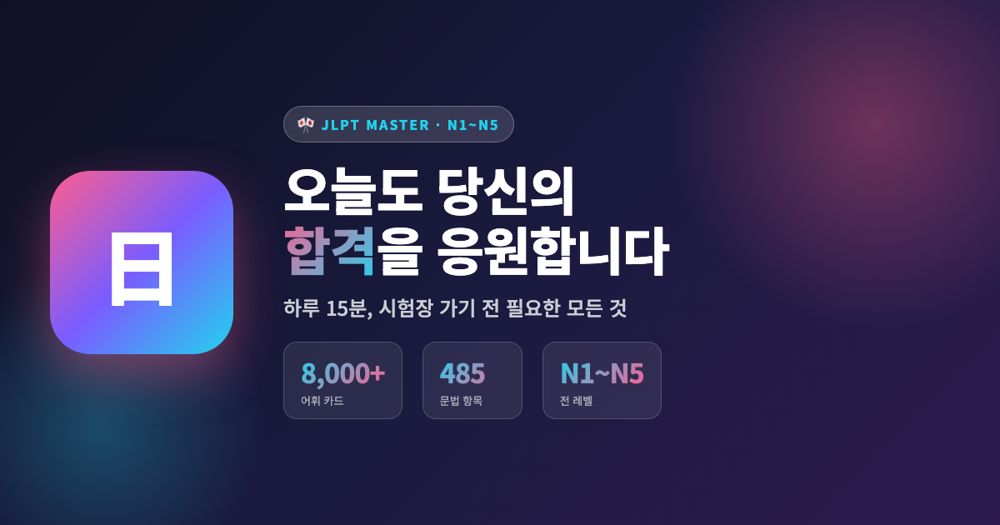
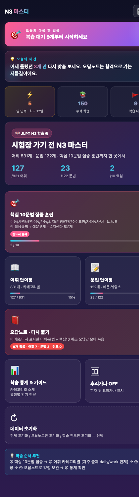

<div align="center">

# 🎌 JLPT 마스터

**시험장 가기 전, 딱 필요한 만큼만.**

일본어 능력 시험(JLPT) N1~N5 전 레벨을 한 곳에서 준비하는 웹앱.
어휘 **8,000개**, 문법 **485개**, 핵심 10문법 집중 훈련까지.

[🚀 지금 시작하기](https://johnnymacline.github.io/n3-flash/) ・ [💾 GitHub](https://github.com/JohnnyMacline/n3-flash)



</div>

---

## ✨ 이런 분들을 위해 만들었어요

- 📅 시험까지 얼마 안 남았는데 **뭐부터 봐야 할지 모르겠는** 분
- 📝 두꺼운 문법책 펴놓고 **10분 만에 덮어버린** 분
- 🎧 통근길·자기 전 **5분씩만 짬짬이** 공부하고 싶은 분
- 🇯🇵 **일본어 노래·애니**는 좋아하는데 시험 준비가 막막한 분
- 🔥 **연속 학습 스트릭**으로 습관 만들고 싶은 분

> **하루 15분이면 충분해요.**
> 오늘도 당신의 합격을 응원합니다.

---

## 📸 스크린샷

<table>
  <tr>
    <td align="center">
      
      <br><b>N1 ~ N5 레벨 선택</b>
      <br><sub>내 목표에 맞는 레벨부터</sub>
    </td>
    <td align="center">
      
      <br><b>오늘의 다음 한 걸음</b>
      <br><sub>다음에 뭘 할지 앱이 알려줘요</sub>
    </td>
    <td align="center">
      
      <br><b>3D 플립 플래시카드</b>
      <br><sub>탭하면 뒤집혀요</sub>
    </td>
  </tr>
</table>

---

## 🎯 이런 게 있어요

### 📚 콘텐츠

| 레벨 | 어휘 | 문법 | 특별 콘텐츠 |
|:---:|:---:|:---:|:---|
| **N5** | 718개 | 80개 | 히라가나·가타카나 기초 |
| **N4** | 668개 | 85개 | て형·수동 기초 |
| **N3** | 831개 | 120개 | **핵심 10문법 집중 훈련** (반드시 출제) |
| **N2** | 1,906개 | 100개 | 관용표현·독해 확장 |
| **N1** | 2,698개 | 100개 | 논설·문학 고난이도 |

### 🚀 학습 기능

- **🎯 오늘의 다음 한 걸음** — 다음에 뭘 학습할지 앱이 알려주는 Primary CTA
- **🔥 연속 학습 스트릭** — 오늘 하나만 해도 오늘의 불이 켜져요
- **📝 오답노트** — 어휘·문법·퀴즈 오답 자동 수집, 재출제 방지
- **🎴 3D 플립 플래시카드** — 카드 탭 = 답 확인, 별도 버튼 없이 직관적
- **🈲 후리가나 토글** — 한자 위에 발음 표시 ON/OFF
- **🎯 핵심 10문법 집중 훈련** (N3 전용) — 수동/사역/사역수동/가능/의지/존경/겸양/수수/자타동사/お~になる
  - 각 유형별 활용규칙 + 예문 5개 + 4지선다 5문제
- **📊 통계·진도** — 카테고리별 학습률, 남은 개수 시각화
- **↻ 마지막 학습 이어보기** — 앱 다시 켜도 그 자리에서 이어져요

### 💎 UX 특징

- **레벨별 학습 격리** — N5 진도가 N3 진도와 섞이지 않음 (`lvKey` 로직)
- **모바일 우선 반응형** — Safe-area, viewport-fit, 터치 최적화
- **PWA 지원** — 홈화면 설치, 오프라인 학습 가능
- **가벼운 배포** — 단일 HTML 파일 하나로 배포 (약 1MB)
- **한번에 다 볼 수 있는 랜딩** — 동기부여 메시지 + 3구 통계 + 다음 액션

---

## 🚀 시작하기

### 온라인으로 바로 사용

👉 **[https://johnnymacline.github.io/n3-flash/](https://johnnymacline.github.io/n3-flash/)**

### 로컬에서 실행

```bash
git clone https://github.com/JohnnyMacline/n3-flash.git
cd n3-flash
# 어떤 정적 서버든 OK
python3 -m http.server 8000
# 또는
npx serve .
```

브라우저에서 `http://localhost:8000` 열기.

### 홈화면에 설치 (PWA)

- **iOS**: Safari에서 열고 → 공유 버튼 → "홈 화면에 추가"
- **Android**: Chrome에서 열고 → 메뉴 → "홈 화면에 추가"
- **PC**: Chrome 주소창의 설치 아이콘 클릭

설치하면 앱처럼 오프라인에서도 사용할 수 있어요.

---

## 🛠️ 기술 스택

- **Vanilla JavaScript** — 프레임워크 없이 순수 JS
- **Single HTML File** — 모든 로직·데이터·스타일이 하나의 파일에
- **LocalStorage** — 학습 진도·오답노트·스트릭 저장
- **Service Worker** — 오프라인 캐시
- **GitHub Pages** — 무료 정적 호스팅

**의도적 선택**: 프레임워크·번들러·의존성 없이 순수 웹 표준으로만 구현해서, 누구나 열어보고 코드를 이해할 수 있어요.

---

## 📦 데이터 출처

이 앱은 아래 오픈 데이터를 기반으로 만들어졌습니다:

- **[jamsinclair/open-anki-jlpt-decks](https://github.com/jamsinclair/open-anki-jlpt-decks)** — JLPT N1~N5 어휘 리스트 (CC-BY)
- **[Sigmabond01/jlpt-grammar-api](https://github.com/Sigmabond01/jlpt-grammar-api)** — JLPT N4/N5 문법 API
- **N3 어휘·문법 · N1/N2 문법** — 앱 개발자 큐레이션 (원저자에게 유래)

각 데이터는 학습 목적의 재배포이며, 상업적 활용을 원하시면 원본 라이선스를 확인해주세요.

---

## 📅 개발 히스토리

이 앱은 **AI 페어 프로그래밍(Vibe Coding)** 으로 만들어졌어요.

```
2026-06-25  Initial N3 flashcards          (첫 커밋)
2026-06-27  중복 방지 + 영구 오답노트
2026-06-28  랜딩 + 핵심10문법 집중훈련
2026-06-29  3D 플립 · 오답노트 뷰
2026-06-30  마지막 위치 이어보기
2026-07-04  퀴즈 오답 재출제 방지 · 한글 번역
2026-07-10  N1~N5 전체 오픈 (어휘 7,800+ · 문법 485+)
2026-07-10  동기부여 UI · PWA · README · OG
```

3주 안에 N3 하나에서 전 레벨 확장까지 완성했어요.

---

## 🤝 기여하기

버그 리포트, 문법·번역 개선, 데이터 추가 모두 환영합니다.

**개선하고 싶은 것 예시:**
- N4·N5 어휘에 한글 뜻·예문 추가
- N1·N2에 CORE10 (레벨별 핵심 문법) 큐레이션
- 다크/라이트 테마 토글
- 학습 데이터 CSV/JSON 내보내기
- 오디오 발음 재생

Issues에서 이야기 나눠주세요.

---

## 📝 라이선스

MIT License · 학습 목적의 개인 프로젝트

**"당신의 합격은 당신의 것, 이 앱은 그 여정의 작은 동반자."**

---

<div align="center">

**⭐ 도움이 되셨다면 GitHub Star로 응원해주세요!**

Made with 💗 for every JLPT learner.

</div>
